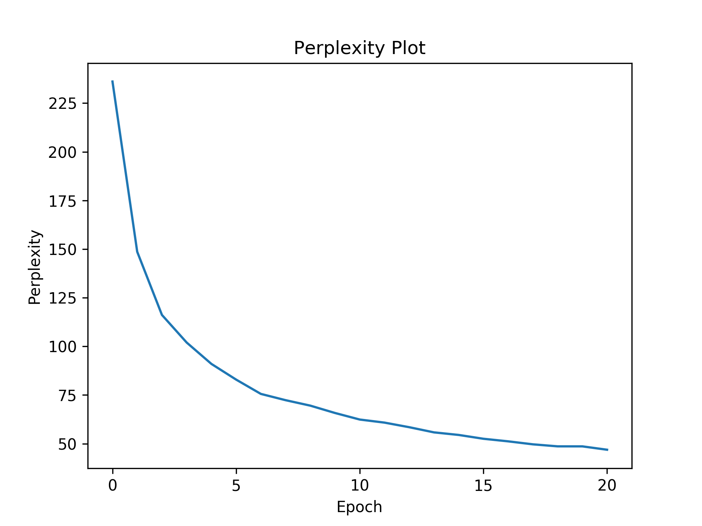
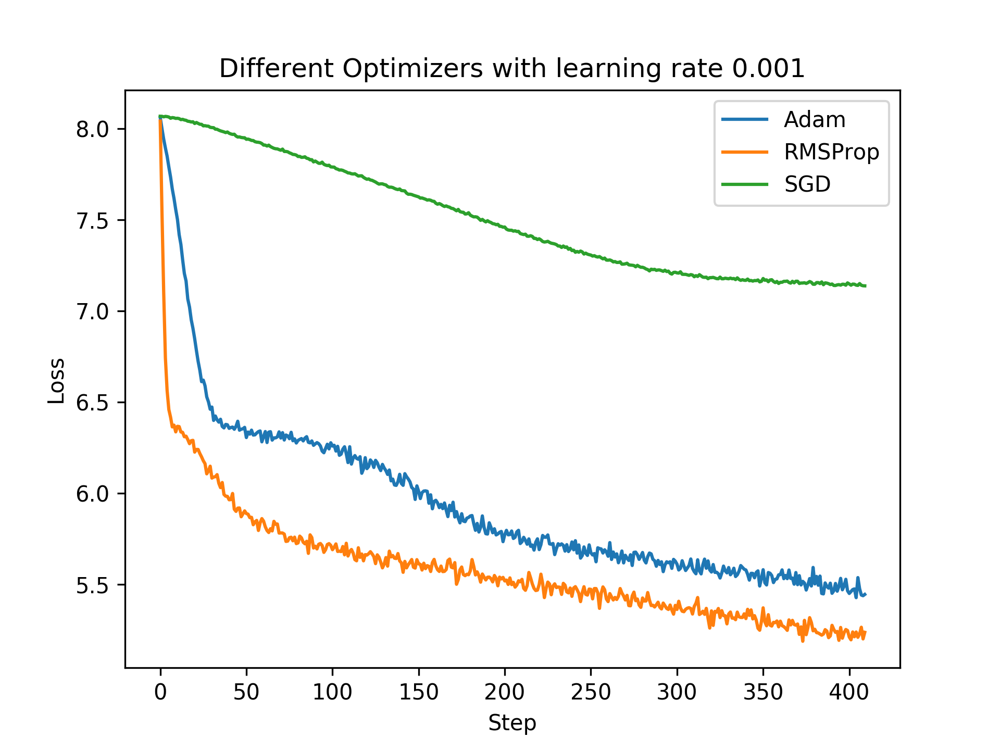
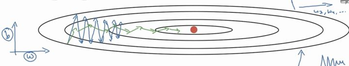

# Assignment 3 Report

## Part 1

In this part, I just stick into [source code](https://github.com/pytorch/pytorch/blob/master/benchmarks/fastrnns/custom_lstms.py) of Pytorch, which implements some variances of LSTM.

### LSTM

$$
\begin{align}
\mathbf{z} &= [\mathbf{h}_{t-1},\mathbf{x}_t]\\
\\
\mathbf{f}_t & = \sigma(\mathbf{W}_f \cdot \mathbf{z} + \mathbf{b}_f) \overset{def} = \sigma(\mathbf{y}_f) \\
\mathbf{i}_t & = \sigma(\mathbf{W}_i \cdot \mathbf{z} + \mathbf{b}_i) \overset{def} = \sigma(\mathbf{y}_i) \\
\mathbf{g}_t & = \tanh (\mathbf{W}_g \cdot \mathbf{z} + \mathbf{b}_g) \overset{def} = \tanh(\mathbf{y}_g) \\
\mathbf{o}_t & = \sigma(\mathbf{W}_o \cdot \mathbf{z} + \mathbf{b}_o) \overset{def} = \sigma(\mathbf{y}_o) \\
\\
\mathbf{c}_t & = \mathbf{f}_t * \mathbf{c}_{t-1} + \mathbf{i}_t * \mathbf{g}_t \\
\mathbf{h}_t &= \mathbf{o}_t * \tanh(\mathbf{c}_t) \\
\end{align}
$$

where $\mathbf{h}_t$ is the hidden state at time $t$, $\mathbf{c}_t$ is the cell state at time $t$, $\mathbf{x}_t$ is the input at time $t$, $\mathbf{h}_{(t-1)}$ is the hidden state of the layer at time $t-1$ or the initial hidden state at time $0$, and $\mathbf{i}_t$, $\mathbf{f}_t$, $\mathbf{g}_t$, $\mathbf{o}_t$ are the input, forget, cell, and output gates respectively. $\sigma$ is the element-wise sigmoid function, $\tanh$ is the element-wise tanh function, and $*$ is the *Hadamard product*.

> Hadamard product is a element-wise product, such that $(AB)_{ij} = a_{ij}b_{ij}$

Then the gradients can be calculated as follows:

Concatenation:
$$
\begin{align}
\frac{\partial \mathbf{z}}{\partial \mathbf{h}_{t-1}} &=
\begin{bmatrix}
\mathbf I_{h\times h} & \mathbf0_{h\times f}\\
\mathbf0_{f\times h} & \mathbf0_{f\times f}\\
\end{bmatrix}\\

\frac{\partial \mathbf{z}}{\partial \mathbf{x}_{t}} &=
\begin{bmatrix}
\mathbf0_{h\times h} & \mathbf0_{h\times f}\\
\mathbf0_{f\times h} & \mathbf I_{f\times f}\\
\end{bmatrix}
\end{align}
$$
where $h$ is the dim of $\mathbf{h}_{t-1}$, i.e., the hidden size, and $f$ is the dim of $\mathbf{x}_t$, i, e, the feature size. 

Leaf Nodes:
$$
\begin{align}

\frac{\partial \mathbf{y}_f}{\partial [\mathbf{W}_f]_{ij}} 
= \frac{\partial \mathbf{y}_i}{\partial [\mathbf{W}_i]_{ij}}
= \frac{\partial \mathbf{y}_g}{\partial [\mathbf{W}_g]_{ij}}
= \frac{\partial \mathbf{y}_o}{\partial [\mathbf{W}_o]_{ij}}
&=
\begin{bmatrix}
\delta_{1i} \mathbf{z}_j \\
\vdots \\
\delta_{ni} \mathbf{z}_j \\
\end{bmatrix} \\

\frac{\partial \mathbf{y}_f}{\partial \mathbf{b}_f} 
= \frac{\partial \mathbf{y}_i}{\partial \mathbf{b}_i}
= \frac{\partial \mathbf{y}_g}{\partial \mathbf{b}_g}
= \frac{\partial \mathbf{y}_o}{\partial \mathbf{b}_o} 
&= \mathbf{I}\\

\frac{\partial \mathbf{y}_\lambda}{\partial \mathbf{z}_\lambda}  
&= \mathbf{W}_\lambda, \lambda=i, f, g, o\\

\frac{\partial c_t}{\partial c_{t-1} }
&=
\begin{bmatrix}
{\mathbf{f}_t}_1 & &\\
& \ddots &\\
& & {\mathbf{f}_t}_n 
\end{bmatrix}\\

\end{align}
$$

Internal (non-leave) nodes:
$$
\begin{align}

\frac{\partial \sigma(\mathbf{y}) }{\partial \mathbf{y}} &
=
\begin{bmatrix}
\mathbf{y}_1 (1-\mathbf{y}_1) & & \\
& \ddots & \\
& & \mathbf{y}_n (1-\mathbf{y}_n) \\
\end{bmatrix} , \mathbf{y}\in \{\mathbf{y}_i, \mathbf{y}_f, \mathbf{y}_o\}\\

\frac{\partial \tanh(\mathbf{y}) }{\partial \mathbf{y}} &
= 
\begin{bmatrix}
1-\tanh^2(\mathbf{y}_1) & &\\
& \ddots &\\
& & 1-\tanh^2(\mathbf{y}_n)\\
\end{bmatrix} \\

\frac{\partial \mathbf{c}_t}{\partial \mathbf{i}_t}
&=
\begin{bmatrix}
{\mathbf{g}_t}_1 &&\\
& \ddots &\\
& & {\mathbf{g}_t}_n
\end{bmatrix}
\\

\frac{\partial \mathbf{c}_t}{\partial \mathbf{g}_t}
&=
\begin{bmatrix}
{\mathbf{i}_t}_1 &&\\
& \ddots &\\
& & {\mathbf{i}_t}_n
\end{bmatrix} \\

\frac{\partial \mathbf{c}_t}{\partial \mathbf{f}_t}
&=
\begin{bmatrix}
[\mathbf{c}_{t-1}]_1 &&\\
& \ddots &\\
& & [\mathbf{c}_{t-1}]_n
\end{bmatrix} 
\end{align}
$$

Root nodes:
$$
\begin{align}
\frac{\partial \mathbf{h}_t} {\partial \mathbf{o}_t} & = 
\begin{bmatrix}
\tanh\mathbf{c}_1 & & \\
& \ddots & \\
& & \tanh\mathbf{c}_n \\
\end{bmatrix} \\

\frac{\partial \mathbf{h}_t} {\partial \tanh \mathbf{c}_t} & = 
\begin{bmatrix}
\mathbf{o}_1 & & \\
& \ddots & \\
& & \mathbf{o}_n \\
\end{bmatrix} \\
\end{align}
$$

Thus by chain rule we have,
$$
\begin{align}
	
	
	\frac{\partial \mathbf{h}_t}{\partial \mathbf{c}_{t-1}} &
	= \frac{\partial \mathbf{h}_t}{\partial \tanh\mathbf{c}_{t}} \cdot \frac{\partial \tanh\mathbf{c}_t}{\partial \mathbf{c}_{t}} \cdot \frac{\partial\mathbf{c}_t}{\partial\mathbf{c}_{t-1}} \\
	
	\\
	\frac{\partial \mathbf{h}_t}{\partial \mathbf{W}_{o}} &
	= \frac{\partial \mathbf{h}_t}{\partial \mathbf{o}_{t}} \cdot \frac{\partial \mathbf{o}_t}{\partial \mathbf{y}_o} \cdot \frac{\partial\mathbf{y}_o}{\partial\mathbf{W}_o} \\
	\frac{\partial \mathbf{h}_t}{\partial \mathbf{b}_{o}} &
	= \frac{\partial \mathbf{h}_t}{\partial \mathbf{o}_{t}} \cdot \frac{\partial \mathbf{o}_t}{\partial \mathbf{y}_o} \cdot \frac{\partial\mathbf{y}_o}{\partial\mathbf{b}_o} \\
	
	\\
	\frac{\partial \mathbf{h}_t}{\partial \mathbf{W}_{i}} &
	= \frac{\partial \mathbf{h}_t}{\partial \tanh\mathbf{c}_{t}} \cdot \frac{\partial \tanh\mathbf{c}_t}{\partial \mathbf{c}_t} \cdot \frac{\partial\mathbf{c}_t}{\partial\mathbf{i}_t} \cdot \frac{\partial\mathbf{i}_t}{\partial\mathbf{y}_i} \cdot \frac{\partial\mathbf{y}_i}{\partial\mathbf{W}_i} \\
	\frac{\partial \mathbf{h}_t}{\partial \mathbf{b}_{i}} &
	= \frac{\partial \mathbf{h}_t}{\partial \tanh\mathbf{c}_{t}} \cdot \frac{\partial \tanh\mathbf{c}_t}{\partial \mathbf{c}_t} \cdot \frac{\partial\mathbf{c}_t}{\partial\mathbf{i}_t} \cdot \frac{\partial\mathbf{i}_t}{\partial\mathbf{y}_i} \cdot \frac{\partial\mathbf{y}_i}{\partial\mathbf{b}_i} \\
	\\
	
	
	\frac{\partial \mathbf{h}_t}{\partial \mathbf{W}_{f}} &
	= \frac{\partial \mathbf{h}_t}{\partial \tanh\mathbf{c}_{t}} \cdot \frac{\partial \tanh\mathbf{c}_t}{\partial \mathbf{c}_t} \cdot \frac{\partial\mathbf{c}_t}{\partial\mathbf{f}_t} \cdot \frac{\partial\mathbf{f}_t}{\partial\mathbf{y}_f} \cdot \frac{\partial\mathbf{y}_f}{\partial\mathbf{W}_f} \\
	\frac{\partial \mathbf{h}_t}{\partial \mathbf{b}_{f}} &
	= \frac{\partial \mathbf{h}_t}{\partial \tanh\mathbf{c}_{t}} \cdot \frac{\partial \tanh\mathbf{c}_t}{\partial \mathbf{c}_t} \cdot \frac{\partial\mathbf{c}_t}{\partial\mathbf{f}_t} \cdot \frac{\partial\mathbf{f}_t}{\partial\mathbf{y}_f} \cdot \frac{\partial\mathbf{y}_f}{\partial\mathbf{b}_f} \\
	
	\\
	\frac{\partial \mathbf{h}_t}{\partial \mathbf{W}_{g}} &
	= \frac{\partial \mathbf{h}_t}{\partial \tanh\mathbf{c}_{t}} \cdot \frac{\partial \tanh\mathbf{c}_t}{\partial \mathbf{c}_t} \cdot \frac{\partial\mathbf{c}_t}{\partial\mathbf{g}_t} \cdot \frac{\partial\mathbf{g}_t}{\partial\mathbf{y}_g} \cdot \frac{\partial\mathbf{y}_g}{\partial\mathbf{W}_g} \\
	\frac{\partial \mathbf{h}_t}{\partial \mathbf{b}_{g}} &
	= \frac{\partial \mathbf{h}_t}{\partial \tanh\mathbf{c}_{t}} \cdot \frac{\partial \tanh\mathbf{c}_t}{\partial \mathbf{c}_t} \cdot \frac{\partial\mathbf{c}_t}{\partial\mathbf{g}_t} \cdot \frac{\partial\mathbf{g}_t}{\partial\mathbf{y}_g} \cdot \frac{\partial\mathbf{y}_g}{\partial\mathbf{b}_g} \\
	\\
	\frac{\partial \mathbf{h}_t}{\partial \mathbf{z}_{t}} &
	= \frac{\partial \mathbf{h}_t}{\partial \tanh\mathbf{c}_{t}} \cdot \frac{\partial \tanh\mathbf{c}_t}{\partial \mathbf{z}_t} + \frac{\partial\mathbf{h}_t}{\partial\mathbf{o}_t} \cdot \frac{\partial\mathbf{o}_t}{\partial\mathbf{z}_t} \\
	&= \frac{\partial \mathbf{h}_t}{\partial \tanh\mathbf{c}_{t}} \cdot \frac{\partial \tanh\mathbf{c}_t}{\partial \mathbf{c}_t} \cdot \frac{\partial \mathbf{c}_t}{\partial \mathbf{z}_t} + \frac{\partial\mathbf{h}_t}{\partial\mathbf{o}_t} \cdot \frac{\partial\mathbf{o}_t}{\partial\mathbf{y}_o} \cdot \frac{\partial \mathbf{y}_o}{\partial \mathbf{z}_t} \\
	&=  \frac{\partial \mathbf{h}_t}{\partial \tanh\mathbf{c}_{t}} \cdot \frac{\partial \tanh\mathbf{c}_t}{\partial \mathbf{c}_t} \cdot (\frac{\partial \mathbf{c}_t}{\partial \mathbf{f}_{t}} \cdot \frac{\partial \mathbf{f}_{t}}{\partial \mathbf{z}_{t}} + \frac{\partial \mathbf{c}_t}{\partial \mathbf{i}_{t}} \cdot \frac{\partial \mathbf{i}_{t}}{\partial \mathbf{z}_{t}} + \frac{\partial \mathbf{c}_t}{\partial \mathbf{g}_{t}} \cdot \frac{\partial \mathbf{g}_{t}}{\partial \mathbf{z}_{t}}) + \frac{\partial\mathbf{h}_t}{\partial\mathbf{o}_t} \cdot \frac{\partial\mathbf{o}_t}{\partial\mathbf{y}_o} \cdot \frac{\partial \mathbf{y}_o}{\partial \mathbf{z}_t} \\
	\\
	\frac{\partial \mathbf{h}_t}{\partial \mathbf{x}_{t}} &
	= \frac{\partial \mathbf{h}_t}{\partial \mathbf{z}_{t}} \cdot \frac{\partial \mathbf{z}_t}{\partial \mathbf{x}_{t}} \\
	\frac{\partial \mathbf{h}_t}{\partial \mathbf{h}_{t-1}} &
	= \frac{\partial \mathbf{h}_t}{\partial \mathbf{z}_{t}} \cdot \frac{\partial \mathbf{z}_t}{\partial \mathbf{h}_{t-1}} \\
\end{align}
$$
where the formulas of all local gradients have been given. 

### For Requirements

$$
\begin{align}
\mathbf{z} &= [\mathbf{h}_{t-1},\mathbf{x}_t]\\
\mathbf{f}_t & = \sigma(y_f) = \sigma(W_f \cdot \mathbf{z} + b_f) \\
\mathbf{i}_t & = \sigma(y_i) = \sigma(W_i \cdot \mathbf{z} + b_i) \\
\bar{C}_t & = tanh(W_C \cdot \mathbf{z} + b_C) \\
C_t & = \mathbf{f}_t * C_{t-1} + \mathbf{i}_t * \bar{C}_t \\
\mathbf{o}_t & = \sigma(y_o) = \sigma(W_o \cdot \mathbf{z} + b_o) \\
\mathbf{h}_t &= \mathbf{o}_t * tanh(C_t) \\
\end{align}
$$

1. Differentiate one step of LSTM with respect to $\mathbf{h}_t​$ for $\mathbf{f}_t, \mathbf{i}_t, \bar{C}_t, C_t, C_{t-1},\mathbf{o}_t, \mathbf{h}_{t-1}, \mathbf{x}_t, W_f, W_i, W_C, W_o, b_f, b_i, b_C, b_o ​$. i.e. $\frac{\partial \mathbf{h}_t}{\partial \mathbf{f}_t}​$, include your formalization and derivation in your report. 10%

   You can check out my calculation above.

2. Describe how can you differentiate through time for the training of an LSTM language model for sentence $s_1,s_2,\cdots, s_n$. 10%
   $$
   \begin{align}
   \nabla\mathbf{h}_t = & \frac{\partial \mathbf h_t}{\partial \mathbf i_t} \cdot \nabla{\mathbf i_t} + \frac{\partial \mathbf h_t}{\partial \mathbf f_t}\nabla{\mathbf f_t} + \frac{\partial \mathbf h_t}{\partial \mathbf g_t}\nabla{\mathbf g_t} +  \frac{\partial \mathbf h_t}{\partial \mathbf o_t}\nabla{\mathbf o_t}\\
   & + \frac{\partial \mathbf h_t}{\partial \mathbf c_{t}}\nabla{\mathbf c_{t}}
   \end{align}
   $$
   where 
   $$
   \begin{align}
   \nabla\mathbf{c}_t = & \frac{\partial \mathbf c_t}{\partial \mathbf i_t} \cdot \nabla{\mathbf c_t} + \frac{\partial \mathbf c_t}{\partial \mathbf f_t}\nabla{\mathbf f_t} + \frac{\partial \mathbf c_t}{\partial \mathbf g_t}\nabla{\mathbf g_t} +  \frac{\partial \mathbf c_t}{\partial \mathbf o_t}\nabla{\mathbf o_t}\\
   & + \frac{\partial \mathbf c_t}{\partial \mathbf c_{t-1}}\nabla{\mathbf c_{t-1}}, t=1, ..., n
   \end{align}
   $$
   

## Part 2

### For Requirements

1. See [Initialization Part](#Initialization)
2. See [Training Part](#Training) and [Generation Part](#Generation)
3. See [Optimizer Part](#Optimizer)

### Dataset

I have tried to train the model over the whole Tang poetry, but only to find it really hard for loss to converge and that the length of generated poem is hard to learn. Therefore, I **only train 15,000 五言律詩**, since it's neither too short (which make it converge immediately) or too long (which is hard to train with only one layer of LSTM, I think).

### Initialization

The hyper-parameters I chose are as follows

| hyper-parameter | value                                   |
| --------------- | --------------------------------------- |
| Vocabulary size | 3000+ (filtered by min frequency of 10) |
| embedding size  | 256                                     |
| hidden size     | 128                                     |
| learning rate   | 0.01                                    |
| batch size      | 128                                     |

- Hidden size: When struggling with these fancy hyper-parameters, I find that **hidden size really matters**. If the hidden size is not large enough, LSTM cell cannot communicate with each other well, reducing the performance of the output (predictions). With proper hidden size, LSTM cells will be more expressive and the loss is much more easier to decrease.
- Learning rate: In practice, learning rate with **0.01** works extremely well with Adam in my case. I have tried 0.001 but just made it slower to decrease at the beginning.
- Bias and Weight: I initialize the bias of forget gate to 1 to make LSTM easier to remember previous information. As for other parameters, I use sampling from uniform distribution in range $[-a, a]​$, where $a=\frac{1}{\sqrt{hidden\_size} }​$ in order to strike a balance between hidden size and weight values.

- All Zero initialization and all same initializaition?

  Consider such a layer $a_j = \sum\limits_{i=1}^n{W_{ij}\cdot x_i}, j=1,...,m​$, where the input size is $n​$ and output size is $m​$. If the weights are initialized to zero or exactly the same(e.g. all one), the output layer just get exactly the same value and then the derivative with respect to x will also be same, thus all weights will have same value in subsequent iterations, which eventually make it no better than a linear layer.

- Very small or very large initialization?

  If the weight is very small or very large, after applying sigmoid, it will be almost the same(i.e. all 0 or all 1), thus the gradient changes slowly and learning takes a lot of time. 

### Training

- Loss calculation for variable length sequences batch:

  I implement a LSTM, which can deal with **variable length batches** by adding padding to the batch. And the slightly tricky part is how to calculate loss for variable batches. Just mask out the padding values in the output(simply by a element-wise product with a zero-one matrix/vector), and calculate the cross entropy on only those unmasked(i.e. vaild) values(sum up the log-softmax value after masking).

- Overfit problem and early stop:

  Since my dataset is large enough (15000), I don't have to care about the problem of overfitting. (lol)

  And to early stop training, I use the Perplexity metric, which is quite similar to cross-entropy loss. After 20 epochs, it converges with perplexity of 47 on development set.

  

      
  

  

### Generation

To generate a word with given softmax vector $p​$, where $p_i​$ is the probability of word in vocabulary with index $i​$. The naive rule is simply apply argmax at $p​$ to find the word, which the model consider it most likely to be the output, i.e. $\underset{i}{\mathsf {argmax}}\ p_i​$. However, I find there are many unknown tags if the model haven't been trained well. Thus to be more test-friendly, I simple find the most likely "known" word to prevent it from producing unknown tags, i.e., $\underset{i, word_i \ne unknown}{\mathsf {argmax}}\ p_i​$.

Converged at epoch 21, it produced:

日

> 日日長安道，春風不可忘。
> 風吹江水上，雲入白雲飛。
> 水色籠寒水，風雷夜夜舂。
> 何時一相送，不得到前州。

紅

> 紅粉青銅雀，西樓背夕陽。
> 水流涵吐葉，山色夜深寒。
> 清磬和煙火，山花落照明。
> 何時一相送，不得到前州。

山

> 山川何繚繞，江上望晴空。
> 水色秋江闊，風聲秋草生。
> 秋風吹遠岸，白鳥迥宜秋。
> 不得尋常說，何人問此心。

夜

>夜久星沈沒，江湖夜不閑。
>山川無處處，白首望鄉人。
>山色連天闊，風吹草木寒。
>何時一相送，不得到前州。

湖

>湖上臨江岸，春深賈客舟。
>水聲隨水靜，江月夜深寒。
>山色連天闊，風吹草木寒。
>何時一相送，不得到前州。

海

>海上清江上，蕭條楚色深。
>江山望遠近，江海思歸鴻。
>水色遙山遠，沙寒雨露繁。
>遙知江上月，應見白雲歸。

月

>月皎昭陽殿，花開萬戶香。
>山花開復合，春草上階長。
>野客稀疎磬，寒泉漾影微。
>不知山水上，應是夢中流。

As we can see, many `不知` `何時` are produced, which greatly affect the diversity of the poems. In order to address this problem, I introduce a way of **random-k generation**, choosing a word randomly from the k-most likely words to be the output. I try to immitate a kind of **inspiration** by this method. This method can also prevent overfitting problem. And surprisingly it can then produce poems with much better poems! This are poems generated by exactly same model except applying the random-k generation method. 

日

>日晚成霜吹，春深草屋幽。
>水花開綠野，高壁納寒煙。
>野色陰山色，春消酒不乾。
>誰憐一片雨，不敢望無窮。

紅

>紅蘭開夜竹，畫舸逗湘城。
>雨雪消磨盡，山川月照新。
>人情猶不得，不敢更何言。
>若得從公子，誰憐白草多。

山

>山中遺音遠，禪子下南樓。
>水落寒山靜，僧歸漢苑遊。
>山光遙暗日，山鳥上連山。
>欲識青天去，何人到此懽。

夜

>夜久江南曲，風帆滿夜流。
>雲山晴落照，江水夜深村。
>水宿雲山遠，江花照影微。
>何人問漁叟，應是學仙人。

湖

>湖色與年稀，風前獨自知。
>江流不到處，人事不離心。
>有客休明主，看書鬢未乾。
>不嫌人笑事，何計免吾身。

海

>海客來不得，青松一徑深。
>江山晴漾檝，客思不成猨。
>夜色當窗月，山中見鳥來。
>還聞謝公籍，應笑又東風。

月

>月落臨江水，風塵楚塞間。
>水流晴不覺，帆斷白鷗還。
>月上秋山雪，山昏暮鳥來。
>何當見何計，應是學文翁。

### Optimizer

I have try Adam, RMSprop, SGD with momentum and Adadelta in Pytorch. In general RMSProp is the best one, which converge fastest. Adam is like RMSProp, only a little slower than it. Adadelta and SGD are much more slower than them. 

    

#### Why RMSprop works?

RMSprop works as follows:
$$
\begin{align}
For\ each\ &parameter\ w\\
&v_t := \rho v_{t-1} + (1-\rho)*g_t^2\\
&w_{t+1}:= w_t - \frac{\eta}{\sqrt{v_t + \epsilon}}*g_t
\end{align}
$$
where $\eta$ is the initial learning rate, $v_t$ is the exponential average of squares of gradients at time $t$, and $g_t$ is the gradient at time $t$ along parameter $w$. Intuitively, **learning rate for large gradient $g_t$ will be small** since $v_t$ may be large, which is quite different from SGD, where learning rate is large for large gradient. This is really helpful to the situation as shown below, where the blue one is SGD and green one is something like RMSprop.

    

The reason why this works is that neural network functions are most non-convex, which means plenty of saddle points with small gradient. Therefore, RMSprop can get larger learning rate to escape from those saddle points.

